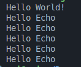

# echo

## About

A toy programming language written in rust.

It is an interpreted lang.

## Dependencies

os := linux mint

rust toolchain := latest

shell := bash

## Language

- Statements end with newline.
- This language has just one function i.e. echo(), to print text to screen.
- Calling echo() is a statement.
- You can call echo as many times as you want.
- String literals are enclosed between double quotes ("This is a String!").
- Comments start with '#' (Only single-line comments)

## Example

There is a hello world example in test directory.
To run it:

```sh
cargo run -- ./test/hello.echo
```



## LICENSE

This project is under MIT License.
